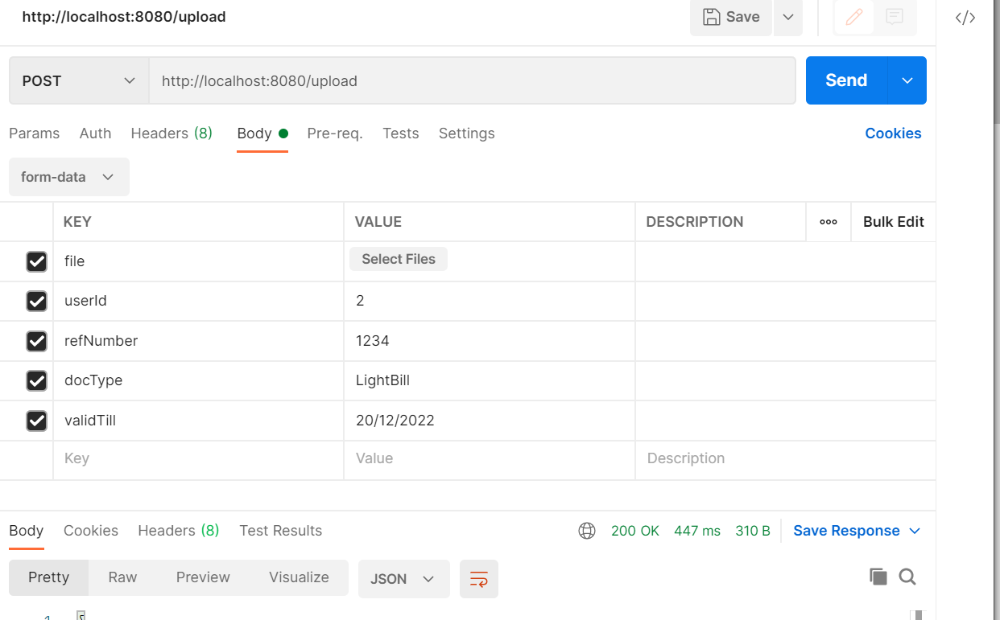
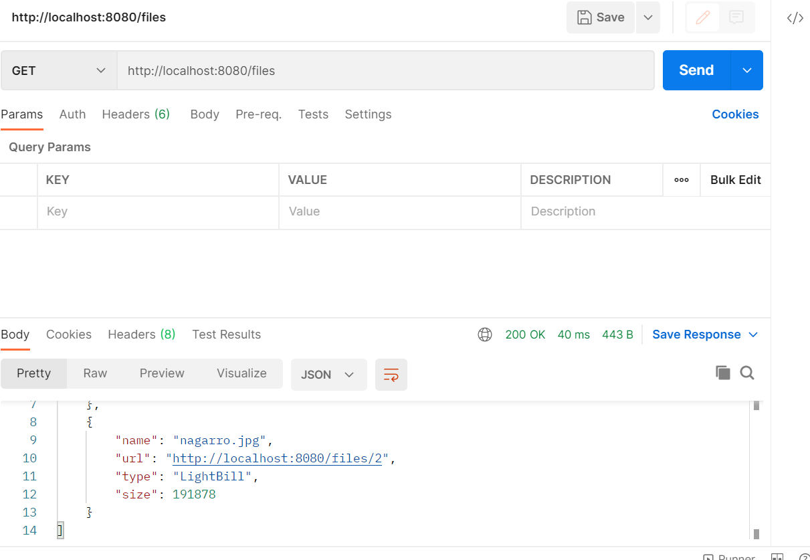

# Getting Started

### Reference Documentation
For further reference, please consider the following sections:
##To connect DB: 
    Update db properties in application.properties file
I am using Postgres DB.

##To Start Application
    java -jar demo-0.0.1-SNAPSHOT.jar (Whatever your jar is)
    or
    You can run main method from DemoApplication.

##Api Calls

